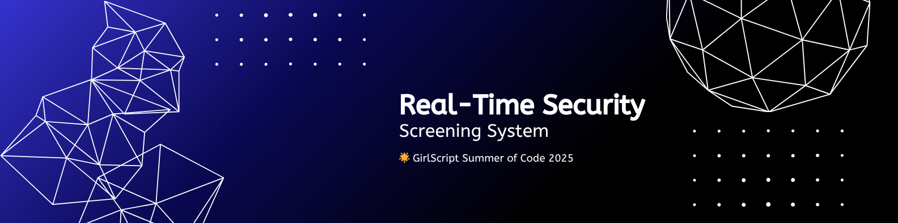

<p align="center">
  
</p>

<p align="center">
  
  
  
</p>


[](https://github.com/SomdattaNag/Security-Screening-System)


<div align="center">
  
</div>


**📊 Project Insights**

<table align="center">
    <thead align="center">
        <tr>
            <td><b>🌟 Stars</b></td>
            <td><b>🍴 Forks</b></td>
            <td><b>🐛 Issues</b></td>
            <td><b>🔔 Open PRs</b></td>
            <td><b>🔕 Closed PRs</b></td>
            <td><b>🛠️ Languages</b></td>
            <td><b>👥 Contributors</b></td>
        </tr>
     </thead>
    <tbody>
         <tr>
            <td></td>
            <td></td>
            <td></td>
            <td></td>
            <td></td>
            <td></td>
            <td></td>
        </tr>
    </tbody>
</table>


**📑 Table of Contents**

- [Problem Statement](#-problem-statement)
- [Proposed Solution](#-proposed-solution)
- [Contributors and learning resources](#-contributors-and-learning-resources)
- [Features](#-features)
- [Workflow](#-workflow)
- [Note](#-note)
- [Acknowledgement](#acknowledgments)
- [License](#-license)
- [Legal](#legal)


**🌟 Exciting News...**

## 🌟 Open Source Journey — GSSoC 2025

🚀 This project was an official part of **GirlScript Summer of Code – GSSoC'25** (July–October 2025). Over the course of the 3-month program, we welcomed contributors from across India and beyond who helped build, test, and grow Security-Screening-System into a production-level system. 🎉

GSSoC is one of India's **largest 3-month open-source programs**, encouraging developers of all levels to contribute to real-world projects while learning, collaborating, and growing together.

During GSSoC'25, contributors to this project:
- ✨ Improved and extended core features
- 🤝 Collaborated on real-world security system challenges
- 🏆 Got recognized for their contributions
- 📜 Earned certificates and points

🎉 **A huge thank you to every contributor who was part of the GSSoC 2025 journey on this project!** 💖

> The GSSoC 2025 program has concluded. This project continues to be open source and welcomes contributions from the community — see the contribution guidelines below.


## 🧩 Problem Statement

In places like airports, hotels, and event venues, security checks are usually done by humans. They check ID cards and watch people manually. But this process takes a lot of time and can have many mistakes. For example, someone might use a fake ID, or look very similar to another person, and the security team might not notice. It’s also hard for them to quickly find people who are dangerous or not allowed to enter.
Because of this, there is a growing need for a better system. We need a smart, automatic solution that can check people’s identities using their face (facial recognition). This system should work smoothly without stopping the normal flow of people. It should also be safe, accurate, and easy to use in many places.


## 💡 Proposed Solution

We are creating a smart security system that uses facial recognition with the help of OpenCV. This system will work in real-time using a webcam at places like airports or hotels.
When a person walks in front of the camera, the system will scan their face and compare it with a database of known criminals, wanted people, or other threats.
If it finds a match, it will quickly raise a threat alert and send warning messages or phone alerts to the authorities, depending on how serious the threat is.
If there’s no match and the person is safe, a safe signal will be shown, and they can move ahead without any issues.This makes security faster, smarter, and more reliable.


## 👥 Contributors and Learning Resources

This project was part of GirlScript Summer of Code 2025 (July–October 2025). 
For contribution tips and extended documentation, see the [Learn Guide](./learn.md).

The project is open source and community contributions are welcome. Please read the README carefully to understand the project workflow before contributing.


## ✨ Features

1. The system uses a webcam to scan each person and detect their face.
2. Before running face recognition, the system now uses a YOLOv5-based **Accessory Detection Module** to check if the person is wearing any **mask, sunglasses, or cap**.
3. If any accessory is detected:
   - A GUI warning is shown telling the individual to remove it.
   - Face recognition is paused (frames keep running, no freezing).
   - Once the accessory is removed for a few consecutive frames, normal face recognition resumes.
4. Once a clear face is detected, it checks the system’s database to see if the person is on a list of wanted, banned, or runaway individuals. The system uses a standard threshold of 0.4 face distance or 60% confidence score to determine a match. Admin can manually change the threshold settings via the GUI. The threshold setting is specifically designed to range upto 0.39 face distance or only from 60-100 % match, since we are prioritising a strict face recognition in order to avoid mistaken identity & prevent unnecessary public alerts.
5. The system takes around 10 seconds to carefully analyze the face and decide if it matches someone in the database.
6. If the person is not in the database, a safe signal is shown, and they can continue without any problem.
7. If the system does find a match:
   A threat alert is activated.
   An email or SMS is sent to the authorities based on how serious the threat is (low, medium, or high).
   If the match is very strong (over 90% confidence), a call alert is also triggered for urgent action.
8. The system automatically saves the image and details of the matched person for legal and verification records.
9. To improve accuracy, the system supports data augmentation. You can run a file called `data_augmentation.py` after adding new images to make the face recognition work better.


## 🔁 Workflow

The system starts by organizing images into folders—one for each wanted person. More images improve accuracy. These images are then encoded using the face_recognition library, converting facial features into numerical values and labeling them based on folder names.

During real-time scanning with OpenCV, the webcam detects and extracts faces, which are then compared with stored encodings. If the similarity is below 0.4, the person is considered a match. The system waits 10 seconds to confirm identity and avoids duplicate alerts within 30 seconds. The system uses a standard threshold of 0.4 face distance or 60% confidence score to determine a match. Admin can manually change the threshold settings via the GUI. The threshold setting is specifically designed to range upto 0.39 face distance or only from 60-100 % match, since we are prioritising a strict face recognition in order to avoid mistaken identity & prevent unnecessary public alerts.

If no match is found, a safe_alarm is triggered. If a match is found, a threat_alarm is activated, followed by email and SMS alerts containing the individual’s name, photo, time, and IP location. If the threat is major (confidence > 90%), a call alert is also triggered.

Matched faces and related data (name, time, confidence) are saved to a .csv file for tracking and verification. To improve recognition accuracy, users can run data_augmentation.py after adding new images.


<h2>Technology Used🚀</h2>

Python, OpenCV,  Face Recognition, SMTPLib, playsound, PyTorch, Tkinter, Twilio, Pillow.


<h2>Getting Started</h2>

**1.** Start by forking the [Security-Screening-System](https://github.com/SomdattaNag/Security-Screening-System) repository. 

**2.** Clone your forked repository:

```bash
git clone https://github.com/<your-github-username>/Security-Screening-System
```

**3.** Navigate to the new project directory:

```bash
cd Security-Screening-System
```

**4.** Set upstream command:

```bash
git remote add upstream https://github.com/SomdattaNag/Security-Screening-System
```

**5.** Create a new branch:

```bash
git checkout -b YourBranchName
```

<i>or</i>

```bash
git branch YourBranchName
git switch YourBranchName
```

**6.** Sync your fork or local repository with the origin repository:

In your forked repository, click on the `Fetch upstream` button.
Then select `Fetch and merge` to sync changes from the original repo.

***Alternatively, use Git CLI to sync with the original repository:***

```bash
git fetch upstream
```

```bash
git merge upstream/main
```

**7.** After syncing, go ahead and make your changes in the codebase.

**8.** Before Running main.py, Install Requirements
```bash
pip install -r requirements.txt
``` 

**9.** Stage your changes and commit them:

⚠️ **Make sure** not to commit sensitive files like .env or any files listed in .gitignore.

⚠️ **Make sure** not to run the commands `git add .` or `git add *`. Instead, stage your changes for each file/folder

```bash
git add file/folder
```

```bash
git commit -m "<your_commit_message>"
```

**10.** Push your changes to GitHub:
Use the command below to push your branch to your GitHub repository:

```bash
git push origin YourBranchName
```
**11.** Create a Pull Request!

 **🎉 Congratulations! You've successfully made your first contribution!**


<h2> Rules for Contributors </h2>

**1.** Assignement to contributors is on a FCFS ( First Come First Serve basis), whoever comments first gets assigned first.

**2.** The contributors who comes next, gets assigned if the previous assignee doesn't complete their task.

**3.** General deadline for each level of assignment:
       1. level 1: maximum 2-3 days
       2. level 2: maximum 5-6 days
       3. level 3: maximum 7-8 days
**4.** If contributors want more days to work, deadline can be extended.


## 📝 Note

1. This project is a working prototype built for security checkpoint scenarios. It showcases the core logic of real-time facial recognition and threat detection. The system is modular and can be expanded with IoT devices or a GUI if needed.

2. The matching threshold is set lower to avoid false positives. As a result, a few false negatives may occur. False positives can be handled via extra document verification and other procedures but false negatives can lead to harassment.

3. For better accuracy, it's advised to include a large and diverse set of images for each individual in the dataset.

4. The system only stores data of individuals flagged as threats or confirmed matches for legal verification. No data is stored for safe or non-matching individuals, ensuring user privacy. All stored data is handled with strict confidentiality.

5. Because YOLOv5 is licensed under AGPL-3.0, any modifications or distribution of this project that include YOLOv5 must also comply with the same license terms. 


## Acknowledgments
- This project uses [Ultralytics YOLOv5](https://github.com/ultralytics/yolov5) (AGPL-3.0) for training an accessory-detection model.  
- Dataset annotations were created using [RoboFlow](https://roboflow.com).  
- The trained model weights (`yolov5n_best.pt`) are derived from YOLOv5’s pretrained `yolov5n.pt`.  
- The folder yolov5 contains necessary files from `Ultralytics YOLOv5` needed to load model.


## Legal
- Uses [Ultralytics YOLOv5](https://github.com/ultralytics/yolov5) (**AGPL-3.0**).  
- Custom weights (`yolov5n_best.pt`) trained via RoboFlow.  
- **AGPL-3.0 applies to all derivative works.**


## 📜 Code of Conduct

Please refer to the [`Code of Conduct`](https://github.com/SomdattaNag/Security-Screening-System/blob/main/codeofConduct.md) for details on contributing guidelines and community standards.


## 🤝👤 Contribution Guidelines

We love our contributors! Please read the [Readme](./READEME.md) and [Learn Guide](./learn.md) carefully.

>Thank you once again to all our contributors who has contributed to **Security-Screening-System!** Your efforts are truly appreciated. 💖👏

<!-- Contributors badge (auto-updating) -->

[](https://github.com/SomdattaNag/Security-Screening-System/graphs/contributors)

<!-- Contributors avatars (auto-updating) -->
<p align="left">
  <a href="https://github.com/SomdattaNag/Security-Screening-System/graphs/contributors">
    
  </a>
</p>

See the full list of contributors and their contributions on the [`GitHub Contributors Graph`](https://github.com/SomdattaNag/Security-Screening-System/graphs/contributors).

<h2 align="center">
<p style="font-family:var(--ff-philosopher);font-size:3rem;"><b> Show some  by starring this awesome repository!
</p>
</h2>


**💡 Suggestions & Feedback**

Feel free to open issues or discussions if you have any feedback, feature suggestions, or want to collaborate!


**🙌 Support & Star**

***If you find this project helpful, please give it a star ⭐ to support more such educational initiatives!***


## 📄 License

This project is licensed under the [GNU Affero General Public License v3.0 (AGPL-3.0)](https://www.gnu.org/licenses/agpl-3.0.html).

The project includes code derived from the [YOLOv5](https://github.com/ultralytics/yolov5) repository, which is also licensed under AGPL-3.0.

By using this project, you agree to comply with the terms of the AGPL-3.0 license.

This project is licensed under the MIT License - see the [`License`](https://github.com/SomdattaNag/Security-Screening-System/blob/main/LICENSE) file for details.


**⭐ Stargazers**

<div align="center">
  <a href="https://github.com/SomdattaNag/Security-Screening-System/stargazers">
    
  </a>
</div>


**🍴 Forkers**

<div align="center">
  <a href="https://github.com/SomdattaNag/Security-Screening-System/network/members">
    
  </a>


<h1 align="center"> Give us a Star and let's make magic! </h1>

<p align="center">
     
</p>


**👨‍💻 Built with ❤️ by the Security-Screening-System Team**

**❤️ Somdatta Nag and Contributors ❤️** [open an issue](https://github.com/SomdattaNag/Security-Screening-System/issues) | [Report Bug](https://github.com/SomdattaNag/Security-Screening-System/issues)


<div align="center">
    <a href="#top">
        
    </a>
</div>


**Ready to show off your coding achievements? Get started with Security-Screening-System today! 🚀**
